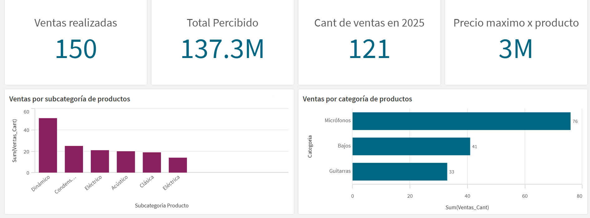
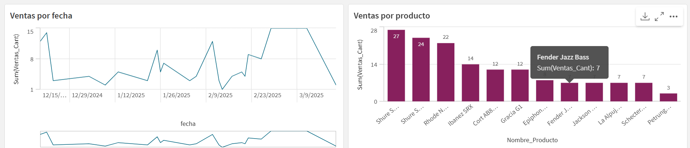

# 📊 JD Audio - Monitoreo Analítico de la tienda de instrumentos JD Audio

Este proyecto forma parte de la práctica del **Módulo 2.1** de Jupi Digital. Consiste en el diseño y desarrollo de un **dashboard analítico** en **Qlik Sense**, orientado a monitorear el rendimiento comercial de la **tienda principal** de JD Audio.

El objetivo es obtener una **visión integral del desempeño de productos**, detectar tendencias de ventas, y facilitar la **toma de decisiones estratégicas** mediante un modelo de datos jerárquico y visualizaciones interactivas.

## 📁 Archivos de origen

Se utilizaron los siguientes archivos Excel como fuentes de datos:

1. `Instrumentos.xls` – Detalle de productos e identificadores.
2. `Categoria.xlsx` – Jerarquía y categoría de cada producto.
3. `Ventas.xlsx` – Registro de ventas por fecha, cantidad, y monto.

> 📌 Estos archivos están disponibles en la raíz del repositorio para uso local.

## 🛠️ Proceso de desarrollo

### 1. Modelo de datos

Se diseñó un modelo con relaciones entre:

- **Instrumentos**: ID, nombre, precio unitario
- **Categorías**: ID de categoría y descripción jerárquica
- **Ventas**: Fecha, cantidad vendida, total de venta, estado de liquidación

Los datos se integraron utilizando claves como `ID_Inst`, `ID_Categoria` y `ID_Fact`.

### 2. Preparación y transformación

- Se aplicó limpieza de datos y tipificación de fechas.
- Se calcularon campos derivados:
  - Año (`Year`)
  - Precio total (`Ventas_Cant * P_Unitario`)
  - Precio máximo por producto

### 3. Visualizaciones implementadas

- **KPI de ventas totales y unidades vendidas**
- **Gráfico de barras**: Ventas por categoría de instrumento
- **Gráfico de líneas**: Tendencias mensuales de ventas
- **Mapa de calor o tabla**: Productos con mayor impacto en ventas
- **Filtro por estado de liquidación**

> Todas las visualizaciones están conectadas mediante modelo asociativo de Qlik Sense.

## 🔍 Análisis e insights

- Se identificaron los **productos con mayor volumen de ventas** tanto en unidades como en valor monetario.
- Algunas categorías como **Cuerdas y Percusión** destacaron por su alto rendimiento.
- Se observó una **tendencia creciente en las ventas mensuales** durante el segundo semestre.
- Se detectaron productos con **precio unitario alto pero baja rotación**, útiles para ajustar el stock.
- El análisis del campo **"Estado de liquidación"** permitió entender qué porcentaje de ventas está ya cerrado o en curso.

## 💡 Conclusiones

Este dashboard permitió a JD Audio:

- Evaluar el impacto de cada producto en las ventas totales.
- Optimizar decisiones sobre **inventario**, **promociones** y **estrategia comercial**.
- Detectar **tendencias de consumo** y comportamiento por categoría.
- Facilitar una lectura visual clara del desempeño del negocio.

## 📸 Capturas del dashboard

> Las imágenes se encuentran en la carpeta `/Images` del repositorio.

## 🚀 Cómo abrir el proyecto

1. Descargar los archivos desde este repositorio.
2. Subir los archivos Excel a **Qlik Sense Cloud**.
3. Crear una nueva app y cargar los datos.
4. Construir las visualizaciones siguiendo la estructura del análisis (o ver el documento adjunto).

## 📄 Documento PDF

También se incluye el informe final en formato PDF:

📎 [`Qlik Sense - Venta de instrumentos musicales.pdf`](Dashboard-PDF/JD_Audio.pdf)

## 👨‍💻 Autor

Este proyecto fue realizado por Octavio Alvarez como parte de la formación en Jupi Digital.

